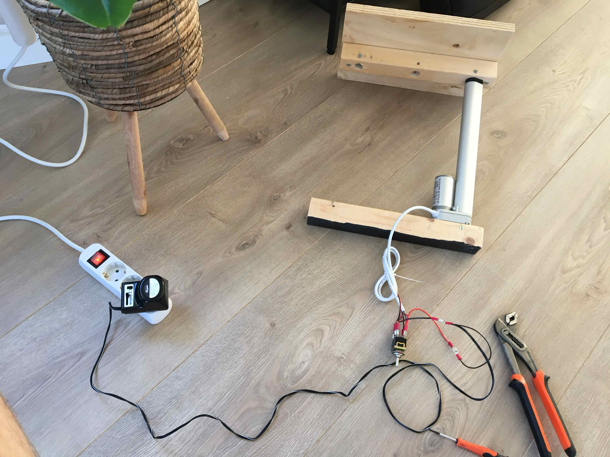

# Hidden Projector

## Description
Inspired by a TV that comes up from a cabinet, I figured the same could be done for a projector.

## Demo

## How does it work?
Two linear actuators, activated by a switch, push up a small platform, revealing the projector. The mechanism is hidden within empty crates of beer, because, wel... they just happened to be around.

    

